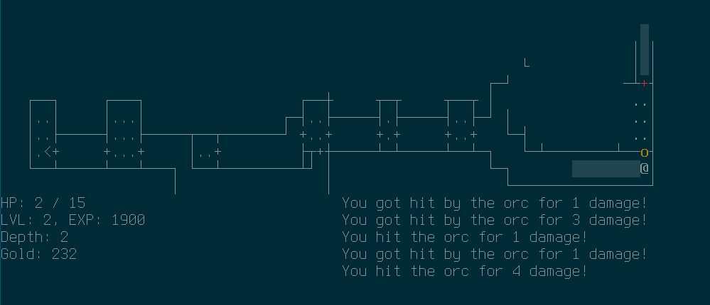

# simplerl

This is a simple roguelike game, using my single-header library
[libroguelike](https://github.com/MichaelMackus/libroguelike). The library
contains a collection of tools such as dungeon generation, pathfinding, and
more things that are useful for roguelikes and/or RPGs.

# Building

To build the game simply run `make`. This does require git for the submodule
and GCC + the curses library for building.

Windows building *should* work with pdcurses, but this has been untested and
might require further tweaking (please create any relevant github issues).

If you'd like to use wide-character support (for "prettier" drawing of dungeon
walls), you can do so by uncommenting the relevant lines in the Makefile. This
requires curses built with wide-character support.

The resulting (static) library will be built at lib/libsimplerl.a and
the game will be built at game/simplerl
